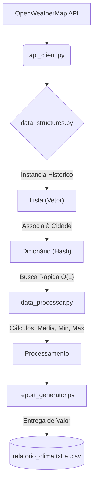

# 🌦️ App de Previsão Climática (Python)

Projeto final para a disciplina de **Estrutura de Dados Aplicada ao Mundo Real**.
O sistema consome dados climáticos reais simulados, armazena em Estruturas de Dados específicas e gera relatórios estatísticos (TXT e CSV).

---

## 🚀 Como Executar o Projeto

**1.** Certifique-se de ter o Python instalado.  
**2.** Instale a biblioteca de requisições:
```bash
pip install requests
```
**3.** Execute o arquivo principal da aplicação:
```bash
python main.py
```
*(O sistema irá processar os dados de Belo Horizonte e gerar os relatórios na sua pasta automaticamente).*

---

## 🧠 Arquitetura e Estruturas de Dados

Para cumprir os requisitos da disciplina, utilizamos as seguintes estruturas:
* **Dicionários (Tabela Hash):** Para indexar as cidades com complexidade de busca **O(1)**.
* **Listas (Vetor Dinâmico):** Para armazenar o histórico temporal e iterar sequencialmente para cálculo de médias e ordenações.

> 📚 **Nota:** A justificativa técnica detalhada das escolhas de estruturas e do fluxo de dados encontra-se no arquivo `Documentacao_Tecnica_Projeto.docx` e nos comentários internos do código `src/data_structures.py`.

---

## 🔄 Fluxo de Dados

Segue o mapa visual de como os dados transitam no software, da API até o Relatório:



---
*Projeto implementado com foco em clareza, modularidade e performance.*
